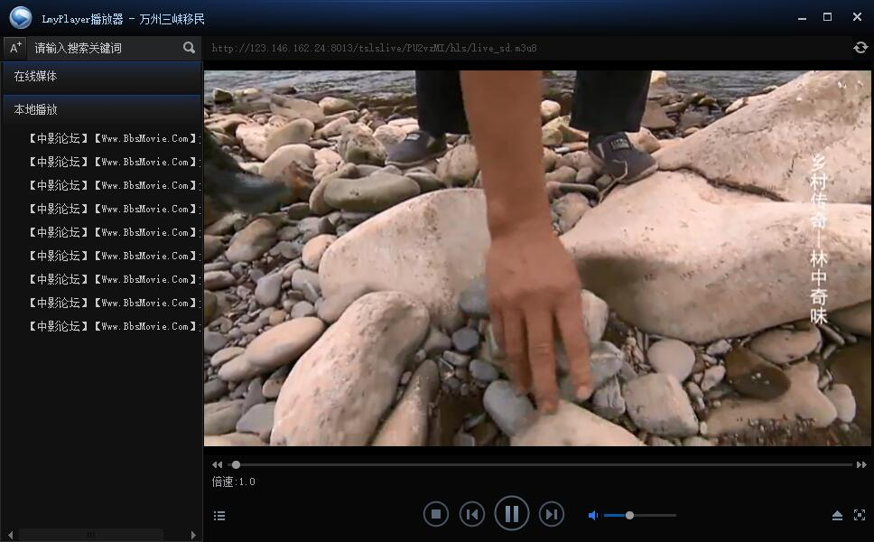

# LmyPlayer播放器

Windows平台, 界面基于 DuiLib 开发，播放核心基于迅雷 APlayer 开发，轻量化，占资源少

## 功能

1. 本地视频播放
2. 在线视频播放
3. 音乐播放

## 使用

- 在线播放数据以 json 格式存储在播放器同目录的 config.db 
- 本地直播数据在 playlist 目录里面 
- APlayer III SDK 下载地址: http://aplayer.open.xunlei.com/APlayerSDK.zip 
- 解码器下载地址: http://aplayer.open.xunlei.com/codecs.zip 

## 效果

